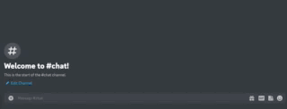

# Charlie Bot

## Overview

Charlie Bot is an AI bot built with Discord.js. Powered by OpenAI, Whether you need help with research, data analysis, or just want to have a conversation, Charlie Bot is here to help.
Charlie Bot is currently in development, so we welcome you to add the bot to your server and report any issues you may encounter.

## Features

* [x] Have a conversation.

You can send direct messages to the bot or mention it within the channel using @Charlie Bot, and it will reply to you.


* [x] Answer questions based on existing knowledge.


* [x] Generate an image based on a text promot.



* [x] Translates input text into other languages.


* [ ] others

## How To Use

### 1. Just join the playgroud server

[Click Me](https://discord.gg/J76a7dV9MD)

### 2. Add the Charlie Bot to your server

[Click Me](https://discord.com/api/oauth2/authorize?client_id=1058228576710819930&permissions=274877918208&scope=bot)

## How To Build You Own Bot

### Prerequisite

#### Setting up a discord bot and generate a token

1. Follow up the [offical documentation](https://discordjs.guide/preparations/setting-up-a-bot-application.html) and create you own bot.
2. Paste the token into the .env file.
3. Create an invite link and add the bot to your server.
a. Open Settings -> URL Generator:
b. Select permissions for the bot:·
c. Copy the link and open in the browser.

| Scope | Permission |
| --- | --- |
| Bot | Read Messages/View Channels |·
| Bot | Send Messages |
| Bot | Send Messages in Threads |

#### Create a OpenAI account and generate an api key

1. Go to [OpenAI Official Site](https://beta.openai.com/) and register an account.
2. Create an api key and paste it into the .env file.

### Configuration

```bash
cp .env.example .env

// paste the variables blow into the .env
DISCORD_TOKEN={token}
OPENAI_ORG={openai_org}
OPENAI_API_KEY={openai_api_key}
```

### Build and Run

```bash
npm install
npm run dev
```

### Deploy

This project provides a quickstart template for Railway. You can deploy it to the cloud with with a single click.

[](https://railway.app/new/template/htdoS6?referralCode=y2J8UJ)

Or you can also deploy via Docker:

```bash
docker build -t charliebot .
docker run -itd --name charliebot --env-file .env charliebot:latest
```